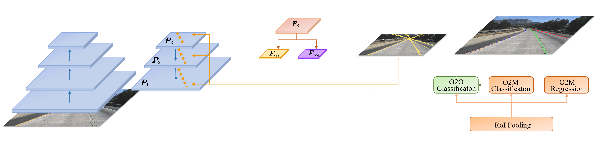
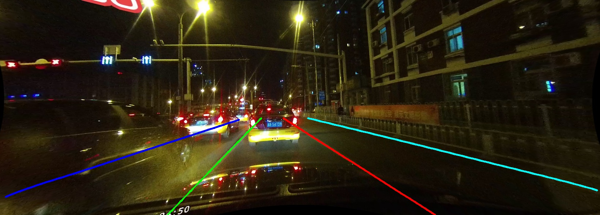
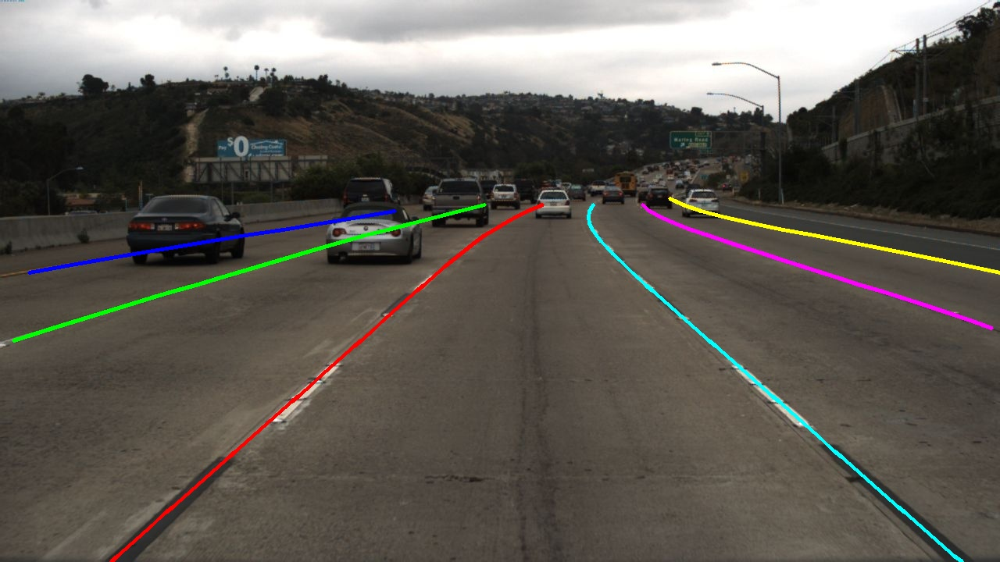
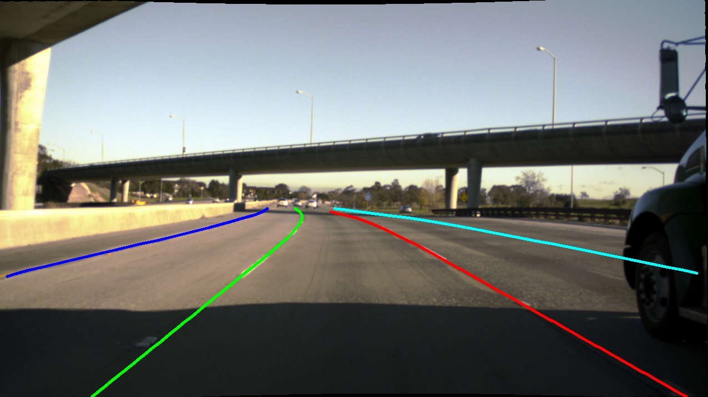
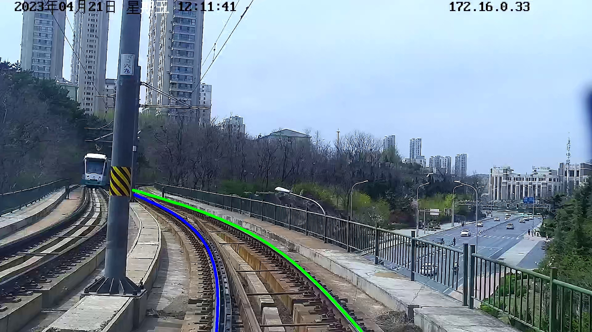
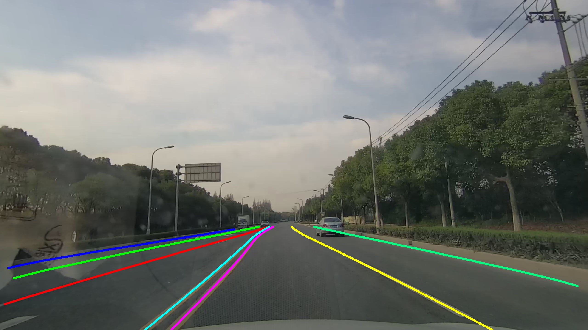
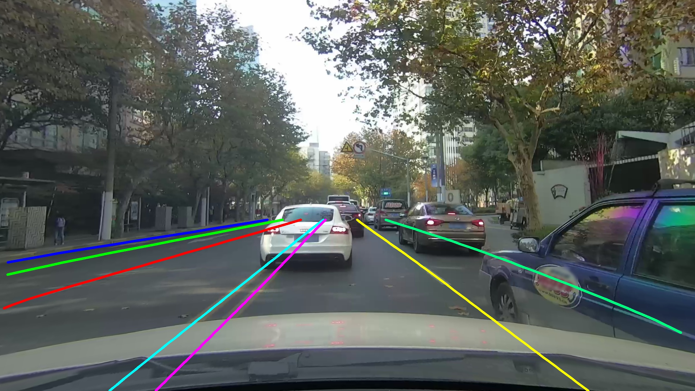
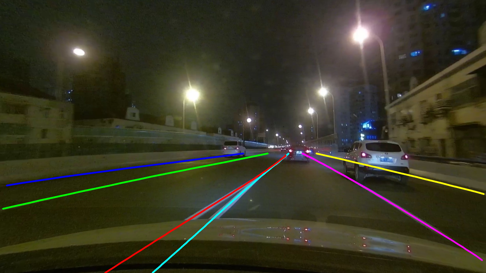
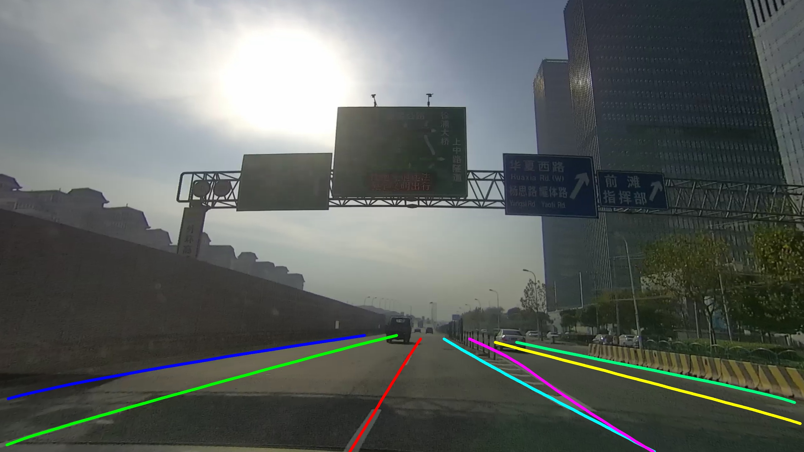

<div align="center">

# Polar R-CNN: A New Baseline for 2D Lane detection

</div>


<!DOCTYPE html>
<html lang="zh">
<head>
    <meta charset="UTF-8">
    <meta name="viewport" content="width=device-width, initial-scale=1.0">
    <title>自适应图片表格</title>
    <style>
        .auto_img {
            width: 100%; /* 宽度占满单元格 */
            height: auto; /* 高度自适应，保持比例 */
            aspect-ratio: 16/9; /* 设置宽高比为16:9，高度自动根据宽度调整 */
        }
        table {
            width: 100%; /* 表格宽度占满父容器 */
            border-collapse: collapse; /* 合并表格边框 */
            border-spacing: 0; /* 去除表格的默认间距 */
            table-layout: fixed; /* 固定表格布局，使单元格宽度均匀 */
        }
        td {
            padding: 5px; /* 控制单元格内边距，减小图片之间的间距 */
            text-align: center; /* 单元格内容居中 */
        }
    </style>
</head>


# Introduction

<div align="center">
  
</div>

PyTorch implementation of the paper "[Polar R-CNN: End-to-End Lane Detection with Fewer Anchors](https://arxiv.org/abs/xxxx)".

Features:
- Reduced Anchor Requirements: 20 anchors is all you need.
- End-to-End Capability: Facilitates training and evaluation absent NMS post-processing.
- Deployment-friendly: Comprises solely of CNNs and MLPs.
- Scalable Framework: Encompasses data preprocessing, model training, performance assessment, and visualization.


# Demo 


<table>
    <tr>
        <td></td>
        <td></td>
        <td></td>
        <td></td>
    </tr>
    <tr>
        <td></td>
        <td></td>
        <td></td>
        <td></td>
    </tr>
</table>

# Get started
For the preparation of datasets and environments, as well as detailed commands, please refer to [INSTALL.md](./INSTALL.md).


# Trained Weights
We provide trained model weights and corresponding config files for CULane, Tusimple, LLAMAS, DL-Rail, and CurveLanes.

| Dataset    | Backbone | F1@50 (NMS-free) | Config | Weight-Link |
| :--------: | :------: | :-----------: | :----: | :---------: |
| CULane     | ResNet18 |    75.0       | [culane_r18](Config/polarrcnn_culane_r18.py) |  |
| CULane     | ResNet34 |    76.0       | [culane_r34](Config/polarrcnn_culane_r34.py) |  |
| CULane     | ResNet50 |    76.0       | [culane_r50](Config/polarrcnn_culane_r50.py) |  |
| CULane     | DLA34    |    76.0       | [culane_dla34](Config/polarrcnn_culane_dla34.py) |  |
| Tusimple   | ResNet18 |   96.11       | [tusimple_r18](Config/polarrcnn_tusimple_r18.py) |  |
| LLAMAS     | ResNet18 |   96.11       | [llamas_r18](Config/polarrcnn_llamas_r18.py) |  |
| LLAMAS     | DLA34    |   96.11       | [llamas_dla34](Config/polarrcnn_llamas_dla34.py) |  |
| DL-Rail    | ResNet18 |   96.11       | [dlrail_r18](Config/polarrcnn_dlrail_r18.py) |  |
| CurveLanes | DLA34    |   81.34       | [curvelanes_dla34](Config/polarrcnn_curvelanes_dla34.py) |  |


# Citation

```BibTeX
@inproceedings{zheng2022clrnet,
  title={Clrnet: Cross layer refinement network for lane detection},
  author={Zheng, Tu and Huang, Yifei and Liu, Yang and Tang, Wenjian and Yang, Zheng and Cai, Deng and He, Xiaofei},
  booktitle={Proceedings of the IEEE/CVF conference on computer vision and pattern recognition},
  pages={898--907},
  year={2022}
}

@inproceedings{honda2024clrernet,
  title={CLRerNet: improving confidence of lane detection with LaneIoU},
  author={Honda, Hiroto and Uchida, Yusuke},
  booktitle={Proceedings of the IEEE/CVF Winter Conference on Applications of Computer Vision},
  pages={1176--1185},
  year={2024}
}

@inproceedings{chen2024sketch,
  title={Sketch and Refine: Towards Fast and Accurate Lane Detection},
  author={Chen, Chao and Liu, Jie and Zhou, Chang and Tang, Jie and Wu, Gangshan},
  booktitle={Proceedings of the AAAI Conference on Artificial Intelligence},
  volume={38},
  number={2},
  pages={1001--1009},
  year={2024}
}
```